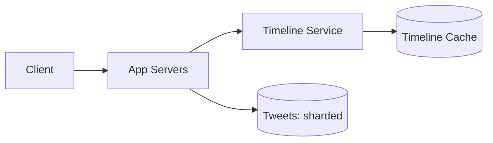

# Design Twitter

> A microblogging service where users post short messages (tweets) and see a timeline of tweets from accounts they follow.

## 1. Requirements

**Functional**
- Post a tweet.
- Follow and unfollow users.
- View a home timeline of recent tweets from followed accounts.

**Non-functional**
- Very read-heavy.
- Low-latency timeline.
- Eventual consistency is fine for the timeline.

## 2. Estimation

Assume 200 million daily active users and 100 million tweets per day. Timeline reads vastly outnumber writes. Tweets are small (text), so the challenge is fan-out and timeline assembly, not raw storage.

See the [estimation cheat sheet](../cheat-sheets/estimation.md).

## 3. API

- `POST /tweets` with the text.
- `GET /timeline` returns a page of the home timeline.
- `POST /follow` and `DELETE /follow`.

## 4. Data model

- Users, Tweets, and a Follows graph.
- Tweets are partitioned by tweet id or user id. The home timeline is often a precomputed list of tweet ids per user, held in a fast store.

## 5. Timeline generation: the key decision

This is the same fan-out problem as a social feed:

| Approach | How | Best for |
|----------|-----|----------|
| Fan-out on write (push) | Insert the tweet id into each follower's timeline | Normal users; fast reads |
| Fan-out on read (pull) | Assemble the timeline at read time | High-follower accounts |
| Hybrid | Push for most, pull for the few with huge followings | The realistic answer |

The hybrid model avoids the write storm when a user with tens of millions of followers tweets.

## 6. Deep dive

- Timeline cache: precomputed timelines in memory for fast reads (see [caching](../patterns/caching.md)).
- Sharding: partition tweets and timelines by user id (see [sharding](../patterns/sharding-partitioning.md)).
- Merging: at read time, merge pushed timelines with pulled tweets from high-follower accounts, sorted by time.

## 7. Bottlenecks and trade-offs

- The high-follower fan-out problem, solved by the hybrid model.
- Write amplification of push vs read cost of pull; the hybrid balances them.
- Read scaling via caching and [replication](../patterns/replication.md).

## High-level design

## Go deeper

- Practice live: [Mock interviews](https://www.designgurus.io/mock-interviews)
- Full course: [Grokking the System Design Interview](https://www.designgurus.io/course/grokking-the-system-design-interview)