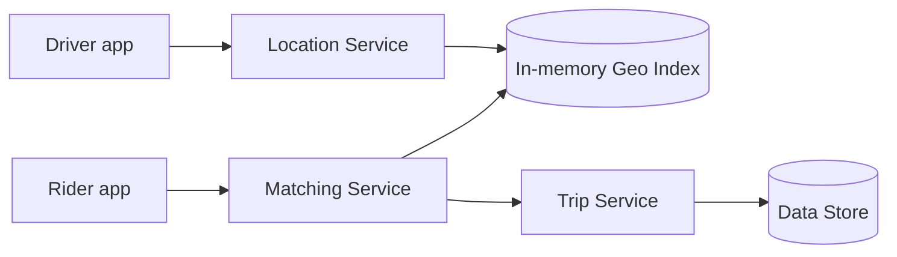

# Design Uber

> A ride-hailing service that matches riders with nearby drivers in real time and tracks the trip.

## 1. Requirements

**Functional**
- Drivers publish their location continuously.
- A rider requests a ride and is matched with a nearby driver.
- Both sides see live location during the trip.

**Non-functional**
- Low latency for matching and location updates.
- High availability.
- Handles dense, hot areas (city centers at rush hour).

## 2. Estimation

Assume millions of active drivers sending location updates every few seconds. That is a very high write rate of location pings, which dominates the design. Matching must be fast and local to a geographic area.

See the [estimation cheat sheet](../cheat-sheets/estimation.md).

## 3. API

- `POST /drivers/location` with driver id and coordinates (very frequent).
- `POST /rides` to request a ride from a pickup location.
- `GET /rides/{id}/location` for live trip tracking.

## 4. Geo-indexing: the key decision

To find nearby drivers quickly, you need a spatial index, not a full scan:

| Technique | Idea |
|-----------|------|
| Geohash | Encode lat/long into a short string; nearby points share a prefix |
| Quadtree | Recursively divide space into quadrants; dense areas split deeper |
| S2 cells | Map the sphere to cells; good for range and neighbor queries |

Drivers are bucketed into cells. A ride request looks up the rider's cell and its neighbors to find candidate drivers.

## 5. High-level design

- Location updates flow through a stream or queue (see [message queues](../patterns/message-queues.md)) into an in-memory geo index that is frequently updated.
- Matching reads the index for the rider's area and applies business rules (distance, rating, car type).

## 6. Deep dive

- Hot areas: a single cell in a busy downtown can be overloaded, so cells must be sized or split to balance load (a quadtree splits dense areas deeper).
- Consistency: driver locations are best-effort and eventually consistent; the latest ping wins.
- Trip state: the active trip needs stronger consistency than location pings.

## 7. Bottlenecks and trade-offs

- The write volume of location pings; absorb it with a stream and in-memory index rather than a database write per ping.
- Geo hotspots; handle with adaptive cell sizing.
- Matching latency vs match quality.

## Go deeper

- For harder problems like this: [Advanced System Design Interview, Volume II](https://www.designgurus.io/course/grokking-system-design-interview-ii)
- Full course: [Grokking the System Design Interview](https://www.designgurus.io/course/grokking-the-system-design-interview)