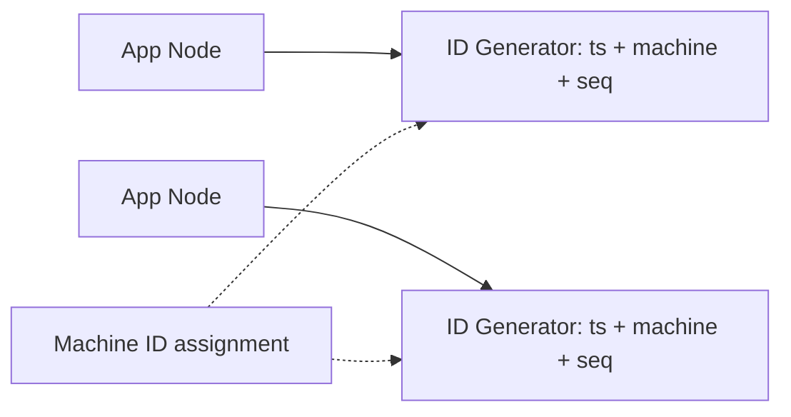

# Design a unique ID generator

> Generate globally unique IDs at high throughput, ideally roughly sortable by time, with no collisions.

## 1. Requirements

- Unique across a distributed system.
- High throughput and low latency.
- Roughly time-ordered is a plus (helps with indexing and pagination).
- Compact (often a 64-bit integer).

## 2. Approaches

| Approach | Pro | Con |
|----------|-----|-----|
| UUID (random) | Simple, no coordination | 128-bit, not time-sortable |
| DB auto-increment | Simple, ordered | Single point, hard to scale |
| Ticket server (range handout) | Scales, ordered | The server is a dependency |
| Snowflake style | Distributed, time-sortable, 64-bit | Needs machine ids and clock care |

## 3. The Snowflake approach

Pack a 64-bit ID as: timestamp bits + machine id bits + per-machine sequence number. Each node generates IDs locally with no coordination, the timestamp prefix makes them roughly sortable, and the sequence number disambiguates IDs created in the same millisecond.

## 4. Deep dive

- Clock skew: if a node's clock moves backward, pause or refuse to issue IDs until it catches up, to avoid duplicates.
- Machine id assignment: hand out via configuration or a coordination service.
- Sequence overflow: if a node exhausts the sequence in one millisecond, wait for the next tick.

## High-level design

## Go deeper

- For the full worked solution: [Advanced System Design Interview, Volume II](https://www.designgurus.io/course/grokking-system-design-interview-ii)
- Full course: [Grokking the System Design Interview](https://www.designgurus.io/course/grokking-the-system-design-interview)