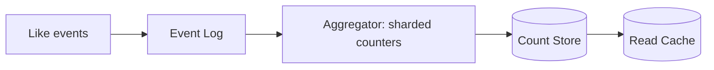

# Design a likes counter (YouTube)

> Count likes for billions of items at very high write rates, with near real-time, approximately accurate reads.

## 1. Requirements

- Handle a huge volume of like and unlike events.
- Show counts that are close to real time.
- Avoid a hot-key bottleneck on popular items.
- Eventual consistency on the displayed count is acceptable.

## 2. The core problem

Writing one database row update per like does not scale: a viral video can take thousands of likes per second, all hitting the same row (a hot key). The fix is to avoid per-event writes to a single counter.

## 3. Approaches

| Approach | Idea |
|----------|------|
| Sharded counters | Split a count across N sub-counters; sum on read | 
| Batched aggregation | Buffer events in memory, flush the delta periodically |
| Stream processing | Events go to a log (Kafka), an aggregator computes counts |

A common design: events stream into a log, a processor aggregates them in time windows, and the running total is written back to a store and cached for reads.

## 4. Deep dive

- Hot keys: sharded counters spread the write load for viral items.
- Idempotency: a user liking twice should count once; track per-user state or dedup events.
- Read path: serve the cached aggregate; it lags slightly, which is fine.

## High-level design

## Go deeper

- For the full worked solution: [Advanced System Design Interview, Volume II](https://www.designgurus.io/course/grokking-system-design-interview-ii)
- Full course: [Grokking the System Design Interview](https://www.designgurus.io/course/grokking-the-system-design-interview)