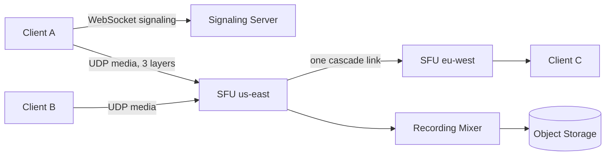

# Design Zoom

> Multi-party video calls that feel instant, worldwide, even on bad networks.

## 1. Requirements

**Functional**
- Create and join meetings, with N-way audio and video.
- Screen share and in-meeting chat.
- Record meetings for later playback.

**Non-functional**
- End-to-end latency under about 200ms, so conversation feels natural. See the [latency numbers](../cheat-sheets/latency-numbers.md) cheat sheet for why the budget is tight.
- Quality degrades gracefully under packet loss instead of freezing.
- Meetings from 2 people up to 10,000.

## 2. The transport insight: media rides UDP

TCP guarantees delivery by retransmitting lost packets. That guarantee is wrong for live video: a retransmitted frame arrives after the moment it described, so it is useless. Fresh-but-lossy beats late-but-reliable. Media therefore travels over UDP (in browsers, via WebRTC), and the client hides loss by skipping a frame or dropping to a lower quality.

Signaling is the opposite case. Join requests, mute state, and the participant roster are small messages that must arrive correctly, so they stay on a reliable channel, usually a [WebSocket](../cheat-sheets/websockets-vs-sse-vs-long-polling.md). In-meeting chat rides the same channel; delivering chat reliably at scale is its own problem (see [Design WhatsApp](design-whatsapp.md)).

## 3. Building blocks

**Signaling server.** Holds meeting state: who is in the room, who is muted, which streams exist. Clients connect to it first, and it brokers the setup of every media connection.

**STUN.** Most clients sit behind NAT (network address translation, the router feature that hides many devices behind one public IP). A STUN server simply tells a client what its public address looks like, so two peers can attempt a direct connection.

**TURN.** When NAT or a firewall blocks direct media, a TURN server relays the packets between the two sides. It always works, but every byte now crosses an extra hop that you pay for.

## 4. Topology: who sends video to whom

| Topology | How it works | Trade-off |
|----------|--------------|-----------|
| Mesh | Every client sends its stream to every other client | No servers in the media path, but upload bandwidth runs out at around 4 participants |
| SFU (selective forwarding unit) | Each client sends one stream up; the server forwards selected streams down | The modern default: server does routing, not video processing |
| MCU (multipoint control unit) | The server decodes all streams and mixes them into one | Cheap for clients, expensive server CPU; used for dial-in phones and recording |

## 5. Scaling the SFU

**Regional SFUs.** Media should travel the shortest possible path, so route each client to an SFU in its region, the same [load balancing](../patterns/load-balancing.md) instinct applied to media servers.

**Cascading.** For a meeting spanning two regions, connect the two regional SFUs to each other. Each stream crosses the ocean once, on one inter-region link, instead of once per remote viewer.

**Simulcast.** Each client uploads the same video at 2 or 3 quality layers. The SFU picks a layer per receiver: full quality for a fast connection, the low layer for a congested one. This is how one attendee on hotel Wi-Fi stops degrading the call for everyone else.

## 6. Deep dive: a 10,000-person webinar is not a call

A conversation needs sub-200ms latency both ways. A webinar does not: only a few people speak, and the audience just watches. So split the system. The handful of active speakers hold a normal SFU call with each other. Everyone else receives a one-way, broadcast-style stream where a few seconds of latency is acceptable, which turns the fan-out into the same problem as [live comment streaming](design-live-comment-streaming.md) on a video platform. Promoting an audience member to speaker means moving them from the broadcast path into the SFU call.

## 7. Recording

Recording is where the MCU becomes the right tool. A mixer subscribes to the meeting's streams like any other participant, composites them into a single video, and writes it to object storage. A transcode pipeline then produces playback formats, the same shape as the upload path in [Design YouTube](design-youtube.md).

## 8. Bottlenecks and trade-offs

- End-to-end encryption vs SFU features: if the server cannot decrypt media, it can still forward packets, but recording, dial-in, and server-side layouts stop working.
- TURN relay cost: relayed media is pure bandwidth expense, so measure what fraction of calls fall back to TURN.
- Mobile clients: decoding many streams drains battery, so send them fewer, lower layers.

## High-level design

## Go deeper

- Full course: [Grokking the System Design Interview](https://www.designgurus.io/course/grokking-the-system-design-interview?utm_source=github&utm_medium=repo&utm_campaign=grokking-system-design&utm_content=questions-design-zoom)
- Related question: [Design YouTube](design-youtube.md)
