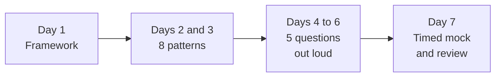

# 1-week crash plan

For when your interview is just days away. Assumes 2 to 3 hours per day. This is triage: cover the essentials and practice, do not try to learn everything.

The repo holds 30 patterns, 60 questions, and 19 deep dives. You are going to read a small fraction of that, on purpose. In one week, a candidate with a reliable framework and four well-practiced questions beats a candidate who skimmed everything.

## The plan

| Day | Focus |
|-----|-------|
| 1 | [Interview framework](../cheat-sheets/interview-framework.md), [estimation](../cheat-sheets/estimation.md), [non-functional requirements](../cheat-sheets/non-functional-requirements.md) |
| 2 | Core patterns: [caching](../patterns/caching.md), [load balancing](../patterns/load-balancing.md), [sharding](../patterns/sharding-partitioning.md), [replication](../patterns/replication.md) |
| 3 | More patterns: [consistency and CAP](../patterns/cap-theorem.md), [message queues](../patterns/message-queues.md), [rate limiting](../patterns/rate-limiting.md), [indexing](../patterns/database-indexing.md) |
| 4 | Practice: [Design TinyURL](../questions/design-tinyurl.md) and [Design Instagram](../questions/design-instagram.md) |
| 5 | Practice: [Design WhatsApp](../questions/design-whatsapp.md) and [Design Uber](../questions/design-uber.md) |
| 6 | One hard question ([Netflix](../questions/design-netflix.md) or [Dropbox](../questions/design-dropbox.md)), then review [trade-offs](../cheat-sheets/trade-offs.md) and [common mistakes](../cheat-sheets/common-mistakes.md) |
| 7 | A timed [mock interview](https://www.designgurus.io/mock-interviews?utm_source=github&utm_medium=repo&utm_campaign=grokking-system-design&utm_content=roadmaps-1-week-plan), then review your weak spots |

## How to spend each day

**Day 1 is the highest-value day.** The framework is what you fall back on when you get a question you have never seen, which is the situation you should expect. Do not just read it. Take any question from the [catalog](../questions/) and force yourself through all seven steps on paper, watching the clock. You will be bad at it. That is the point of doing it on day 1 rather than day 7.

**Days 2 and 3 are eight patterns, not thirty.** These eight cover most of what a general round asks about. For each one, learn what it solves, one trade-off, and one situation where you would not use it. That is enough to discuss it. Depth on a pattern you are never asked about is wasted this week.

**Days 4 to 6 are practice, and practice means out loud.** Reading a walkthrough teaches you almost nothing about performing one. Set a 45-minute timer, work from a blank page, talk the whole time, and only open the page afterwards to see what you missed. Doing two questions properly beats reading six.

**Day 6 also earns its keep from the review.** [Common mistakes](../cheat-sheets/common-mistakes.md) is the fastest read in the repo relative to what it saves you, because most of what sinks candidates at this point is process, not knowledge.

**Day 7 should feel like the real round.** If you can, do a real [mock interview](https://www.designgurus.io/mock-interviews?utm_source=github&utm_medium=repo&utm_campaign=grokking-system-design&utm_content=roadmaps-1-week-plan) with another person. If you cannot, record yourself answering a question you have not practiced and watch it back with [communication tips](../cheat-sheets/communication-tips.md) open.

## What to skip this week

Skipping is the whole plan, so be deliberate about it:

- The [deep dives](../deep-dives/). They are senior and staff signal, and one week is not enough to absorb them.
- The 22 patterns not listed above. Come back for them with the [6-week plan](6-week-plan.md).
- The advanced questions. Two well-practiced core questions are worth more than five you have only read.

The one exception: if you already know the material and are just rusty, this plan is the wrong shape for you. Use the [senior and staff refresher](senior-staff-refresher.md), which starts with a diagnostic and then fixes only the gaps it finds.

## The night before

Do not learn anything new. Re-read [system design in one page](../cheat-sheets/system-design-in-one-page.md) and the [interview framework](../cheat-sheets/interview-framework.md), then stop. If you have 20 minutes, run the [flashcards](../cheat-sheets/flashcards.md) to confirm your recall rather than to find new gaps.

## Tips

- Do not aim for depth on everything. Aim for a solid framework and the ability to talk through the common patterns.
- Read the [communication tips](../cheat-sheets/communication-tips.md). Under time pressure, how you communicate matters more than ever.
- Check how your target company runs the round in the [company index](../companies/README.md). It takes five minutes and it tells you which of these days to weight.

## Go deeper

- Short on time? [System Design Interview Crash Course](https://www.designgurus.io/course/system-design-interview-crash-course?utm_source=github&utm_medium=repo&utm_campaign=grokking-system-design&utm_content=roadmaps-1-week-plan)
- Full course: [Grokking the System Design Interview](https://www.designgurus.io/course/grokking-the-system-design-interview?utm_source=github&utm_medium=repo&utm_campaign=grokking-system-design&utm_content=roadmaps-1-week-plan)
