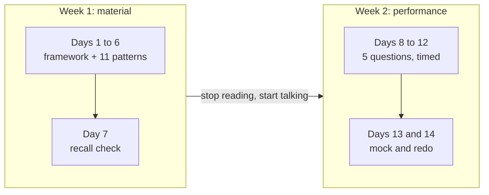

# 2-week system design sprint

A focused plan for when you have an interview coming up soon. Assumes about 1 to 2 hours per day. Adjust to your level.

Two weeks buys you the 11 patterns that carry most answers and five questions practiced properly. It does not buy you all 30 patterns or the deep dives, so the plan spends week 1 on material and week 2 entirely on performing. If you have six weeks, use the [6-week plan](6-week-plan.md) instead and cover everything.

## Week 1: build the foundation

| Day | Focus |
|-----|-------|
| 1 | The [interview framework](../cheat-sheets/interview-framework.md), [estimation](../cheat-sheets/estimation.md), and [non-functional requirements](../cheat-sheets/non-functional-requirements.md) |
| 2 | [Caching](../patterns/caching.md) and [load balancing](../patterns/load-balancing.md) |
| 3 | [Sharding and partitioning](../patterns/sharding-partitioning.md) and [replication](../patterns/replication.md) |
| 4 | [Consistency models](../patterns/consistency-models.md) and the [CAP theorem](../patterns/cap-theorem.md) |
| 5 | [Message queues](../patterns/message-queues.md) and [rate limiting](../patterns/rate-limiting.md) |
| 6 | [SQL vs NoSQL](../cheat-sheets/sql-vs-nosql.md), [database indexing](../patterns/database-indexing.md), [consistent hashing](../patterns/consistent-hashing.md), and [trade-offs](../cheat-sheets/trade-offs.md) |
| 7 | Review: re-explain the 11 patterns from days 2 to 6 from memory, 2 minutes each |

**You are done with week 1 when** you can say what each of those patterns solves, one trade-off it carries, and one situation where you would not reach for it. Do this without the page open. If you need the page, that pattern is not learned yet.

Day 7 is a test, not a reading day. Re-reading feels like progress and produces very little. Explaining something out loud from an empty page is what shows you the gap.

## Week 2: apply to questions

| Day | Focus |
|-----|-------|
| 8 | [Design TinyURL](../questions/design-tinyurl.md) end to end |
| 9 | [Design Instagram](../questions/design-instagram.md) or [Twitter](../questions/design-twitter.md) (feed and timeline) |
| 10 | [Design WhatsApp](../questions/design-whatsapp.md) (a real-time chat system) |
| 11 | [Design Uber](../questions/design-uber.md) (a geo system) |
| 12 | [Design a web crawler](../questions/design-web-crawler.md) or a [notification system](../questions/design-notification-system.md) |
| 13 | A timed [mock interview](https://www.designgurus.io/mock-interviews?utm_source=github&utm_medium=repo&utm_campaign=grokking-system-design&utm_content=roadmaps-2-week-plan) under real conditions |
| 14 | Review your weak spots and redo one question |

Run every one of these days the same way: 45-minute timer, blank page, talking out loud the whole time, page closed. Open the walkthrough only when the timer stops, and write down the difference. The five questions are chosen to cover five different shapes, so the point is not to memorize five answers. It is to notice that the framework carries you through all of them.

**You are done with week 2 when** the first four minutes of a question you have never seen feel automatic.

## Which patterns you are skipping

This plan covers 11 of the 30 patterns. The other 19 are not unimportant, they just do not fit in two weeks. If a question in week 2 pushes you into one of them, read that single page then rather than trying to cover the set:

- Payments or flash sale questions will send you to [idempotency](../patterns/idempotency.md) and [distributed locking](../patterns/distributed-locking.md).
- Chat and live updates will send you to [long polling, WebSockets, and SSE](../patterns/long-polling-websockets-sse.md).
- Anything with a background worker will send you to [backpressure](../patterns/backpressure.md) and the [outbox pattern](../patterns/outbox-pattern.md).

## Tips

- Always talk out loud and draw. The interview tests communication as much as knowledge.
- After each question, write down what you missed and target it next time.
- Browse the full [question catalog](../questions/) for more practice.
- For senior or staff roles, skim the [deep dives](../deep-dives/) index. There are 19; the first six in its reading order (GFS, BigTable, Dynamo, HDFS, Cassandra, ZooKeeper) give you the most coverage for the time.
- Read [senior vs staff expectations](../cheat-sheets/senior-vs-staff-expectations.md) before your mock, so you know which bar you are being graded against.
- Practice live: [mock interviews with ex-FAANG engineers](https://www.designgurus.io/mock-interviews?utm_source=github&utm_medium=repo&utm_campaign=grokking-system-design&utm_content=roadmaps-2-week-plan).

## Go deeper

- Short on time? [System Design Interview Crash Course](https://www.designgurus.io/course/system-design-interview-crash-course?utm_source=github&utm_medium=repo&utm_campaign=grokking-system-design&utm_content=roadmaps-2-week-plan)
- Full course: [Grokking the System Design Interview](https://www.designgurus.io/course/grokking-the-system-design-interview?utm_source=github&utm_medium=repo&utm_campaign=grokking-system-design&utm_content=roadmaps-2-week-plan)
