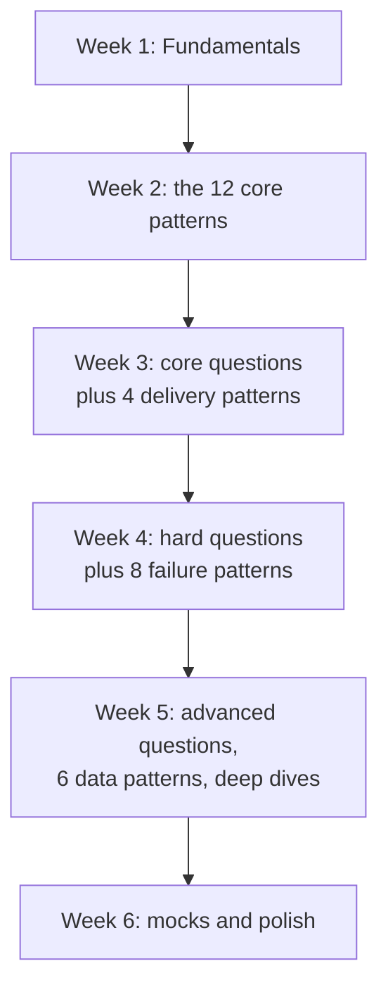

# 6-week study plan

A thorough plan for building real depth from a baseline. Assumes about 1 hour per day. If you have less time, see the [2-week sprint](2-week-plan.md) or the [1-week crash plan](1-week-plan.md). If you have interviewed before and are rusty rather than new, use the [senior and staff refresher](senior-staff-refresher.md) instead, which starts by finding your gaps rather than covering everything.

Six weeks is enough to cover all 30 patterns, roughly 20 questions, and the 19 deep dives, with time left for mock interviews. The plan front-loads the material you use in every answer and leaves the specialized material for later, so that if you run out of time in week 5 you have still covered what matters most.

## Week by week

### Week 1: Fundamentals

The [interview framework](../cheat-sheets/interview-framework.md), [estimation](../cheat-sheets/estimation.md), [non-functional requirements](../cheat-sheets/non-functional-requirements.md), and [trade-offs](../cheat-sheets/trade-offs.md). Get comfortable structuring an answer.

Also read [common mistakes](../cheat-sheets/common-mistakes.md) now rather than at the end. It is much easier to avoid a habit than to unlearn it in week 6.

**You are done with this week when** you can state the seven steps of the framework from memory, with their time budget, and size a system to requests per second and storage per year without a calculator.

### Week 2: The 12 core patterns

These twelve appear in almost every answer, so they get a full week on their own. Roughly two per day.

[Caching](../patterns/caching.md), [load balancing](../patterns/load-balancing.md), [sharding and partitioning](../patterns/sharding-partitioning.md), [replication](../patterns/replication.md), [consistency models](../patterns/consistency-models.md), [CAP theorem](../patterns/cap-theorem.md), [consistent hashing](../patterns/consistent-hashing.md), [message queues](../patterns/message-queues.md), [rate limiting](../patterns/rate-limiting.md), [CDN](../patterns/cdn.md), [database indexing](../patterns/database-indexing.md), and [bloom filters](../patterns/bloom-filters.md).

**You are done with this week when** you can re-explain each one from memory in two minutes, including one trade-off and one situation where you would not use it.

### Week 3: Core questions, plus the delivery patterns

Practice one question per day, end to end and out loud: [TinyURL](../questions/design-tinyurl.md), [Instagram](../questions/design-instagram.md), [Twitter](../questions/design-twitter.md), [WhatsApp](../questions/design-whatsapp.md), [rate limiter](../questions/design-rate-limiter.md), and [notification system](../questions/design-notification-system.md).

Alongside them, pick up the four patterns that decide how requests reach your system: [proxies](../patterns/proxies.md), [API gateway](../patterns/api-gateway.md), [long polling, WebSockets, and SSE](../patterns/long-polling-websockets-sse.md), and [backpressure](../patterns/backpressure.md). The chat and notification questions will make all four concrete.

**You are done with this week when** you can take any of those six questions from a blank page to a defended design in 45 minutes.

### Week 4: Harder questions, plus the failure patterns

The harder set: [Uber](../questions/design-uber.md), [Netflix](../questions/design-netflix.md), [Dropbox](../questions/design-dropbox.md), [web crawler](../questions/design-web-crawler.md), [payment system](../questions/design-payment-system.md), and [flash sale](../questions/design-flash-sale-system.md).

These are the questions where things break, so pair them with the eight patterns about surviving failure: [quorum](../patterns/quorum.md), [leader election](../patterns/leader-election.md), [heartbeats](../patterns/heartbeats.md), [checksums](../patterns/checksums.md), [idempotency](../patterns/idempotency.md), [distributed locking](../patterns/distributed-locking.md), [write-ahead log](../patterns/write-ahead-log.md), and [circuit breaker](../patterns/circuit-breaker.md).

Idempotency and distributed locking are the two the payment and flash sale questions turn on, so give them the most time.

**You are done with this week when** you can answer "what happens when that node dies" for every box you draw.

### Week 5: Advanced questions, data patterns, and deep dives

The advanced questions: [unique ID generator](../questions/design-unique-id-generator.md), [recommendation system](../questions/design-recommendation-system.md), [Google Docs](../questions/design-google-docs.md), [distributed message queue](../questions/design-distributed-message-queue.md), [stock exchange](../questions/design-stock-exchange.md), and [ad click aggregator](../questions/design-ad-click-aggregator.md).

The last six patterns are about how data moves and stays correct: [batch vs stream processing](../patterns/batch-vs-stream-processing.md), [distributed transactions](../patterns/distributed-transactions.md), [event sourcing and CQRS](../patterns/event-sourcing-cqrs.md), [outbox pattern](../patterns/outbox-pattern.md), [gossip protocol](../patterns/gossip-protocol.md), and [logical clocks](../patterns/logical-clocks.md). That completes all 30.

Then start the [deep dives](../deep-dives/). There are 19, which is more than one week holds, so read them in the order the index recommends and stop wherever the week ends:

1. Storage foundations: [GFS](../deep-dives/gfs-distributed-file-system.md), [BigTable](../deep-dives/bigtable-wide-column-store.md), [Dynamo](../deep-dives/dynamo-key-value-store.md).
2. Open-source counterparts: [HDFS](../deep-dives/hdfs-file-storage.md), [Cassandra](../deep-dives/cassandra-wide-column-db.md), [ZooKeeper](../deep-dives/zookeeper-coordination.md).
3. Coordination and consensus: [Chubby](../deep-dives/chubby-distributed-locking.md), [Raft](../deep-dives/raft-consensus.md).
4. Modern managed databases: [DynamoDB](../deep-dives/dynamodb-managed-nosql.md), [Aurora](../deep-dives/aurora-cloud-native-database.md), [Spanner](../deep-dives/spanner-global-sql.md).
5. Infrastructure at scale: [Kafka](../deep-dives/kafka-distributed-messaging.md), [MapReduce](../deep-dives/mapreduce-batch-processing.md), [Memcached at Facebook](../deep-dives/memcached-at-facebook.md), [Redis internals](../deep-dives/redis-internals.md).
6. Compute and streams: [Borg and Kubernetes](../deep-dives/borg-kubernetes.md), [Flink](../deep-dives/flink-stream-processing.md).
7. Retrieval: [Elasticsearch and Lucene](../deep-dives/elasticsearch-lucene.md), [HNSW and vector databases](../deep-dives/hnsw-vector-search.md).

If you are interviewing for a mid-level role, groups 1 to 4 are enough. Groups 5 to 7 are senior and staff material.

**You are done with this week when** you can name the one idea each system is famous for, in a sentence.

### Week 6: Mocks and polish

Do timed [mock interviews](https://www.designgurus.io/mock-interviews?utm_source=github&utm_medium=repo&utm_campaign=grokking-system-design&utm_content=roadmaps-6-week-plan), review your weak spots, re-read [common mistakes](../cheat-sheets/common-mistakes.md) and [communication tips](../cheat-sheets/communication-tips.md), and prepare for your target company.

Run at least three timed mocks this week, not one. The first one usually goes badly for reasons that have nothing to do with knowledge, and you want that to happen before the real round.

Check how your target company runs the round in the [company index](../companies/README.md), and read [senior vs staff expectations](../cheat-sheets/senior-vs-staff-expectations.md) so you are aiming at the right bar. Finish with the [flashcards](../cheat-sheets/flashcards.md) to find any recall gaps.

**You are done when** you can walk into a question you have never seen and still know what your first four minutes look like.

## If you fall behind

Six weeks of daily study rarely survives contact with a real job. If you lose a week, drop material in this order:

1. Deep dive groups 5 to 7 (week 5).
2. The advanced questions (week 5).
3. The six data patterns (week 5).

Do not drop week 1 or week 2, and do not drop the mock interviews. The framework and the core patterns are what you use in every answer, and mocks are what turn knowledge into a performance.

## Tips

- Always talk out loud and draw.
- Keep a log of what you missed after each question, and revisit it.
- Re-explaining a pattern from memory is worth more than reading it a second time. If you cannot explain it without the page open, you have not learned it yet.

## Go deeper

- Full course: [Grokking the System Design Interview](https://www.designgurus.io/course/grokking-the-system-design-interview?utm_source=github&utm_medium=repo&utm_campaign=grokking-system-design&utm_content=roadmaps-6-week-plan)
- Every pattern, in depth: [System Design Patterns](https://www.designgurus.io/course/system-design-patterns?utm_source=github&utm_medium=repo&utm_campaign=grokking-system-design&utm_content=roadmaps-6-week-plan)
