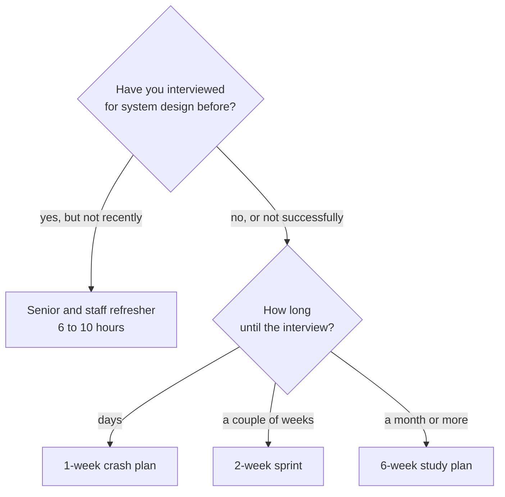

# Roadmaps

Pick the plan that fits your timeline, or the refresher if you have interviewed before.

| Plan | Best when | Time |
|------|-----------|------|
| [1-week crash plan](1-week-plan.md) | Your interview is days away | 2 to 3 hours per day |
| [2-week sprint](2-week-plan.md) | You have a couple of weeks | 1 to 2 hours per day |
| [6-week study plan](6-week-plan.md) | You are building depth from a baseline | About 1 hour per day |
| [Senior and staff refresher](senior-staff-refresher.md) | You have done this before and are rusty | 6 to 10 hours total |

## How much each plan covers

The repo holds 30 patterns, 60 questions, and 19 deep dives. No plan covers all of it, and choosing what to leave out is most of what a plan does for you.

| Plan | Patterns | Questions | Deep dives |
|------|----------|-----------|------------|
| 1-week crash plan | 8 | 5 | none |
| 2-week sprint | 11 | 5 | optional skim |
| 6-week study plan | all 30 | about 18 | all 19, in reading order |
| Senior and staff refresher | only your gaps | 3 timed | only your gaps |

The three timeline plans share one order: learn the [framework](../cheat-sheets/interview-framework.md) and [patterns](../patterns/) first, then practice with [questions](../questions/), then do timed [mock interviews](https://www.designgurus.io/mock-interviews?utm_source=github&utm_medium=repo&utm_campaign=grokking-system-design&utm_content=roadmaps-readme).

The refresher inverts that. It assumes you already know the material, so it starts with a recorded diagnostic to find your actual gaps, and then fixes only those.

## What every plan has in common

Whichever one you pick, three things do most of the work:

1. **The [interview framework](../cheat-sheets/interview-framework.md) comes first.** It is what carries you through a question you have never seen, which is the situation you should plan for.
2. **Practice means out loud, timed, from a blank page.** Reading a walkthrough teaches you the answer. It does not teach you the performance, and the performance is what is graded.
3. **At least one timed mock before the real round.** The first mock usually goes badly for reasons unrelated to knowledge. It is much better for that to happen in practice.
